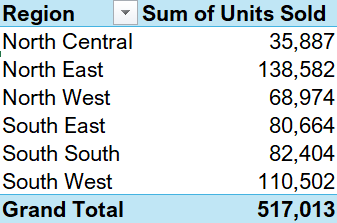
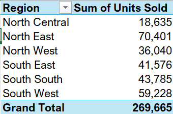
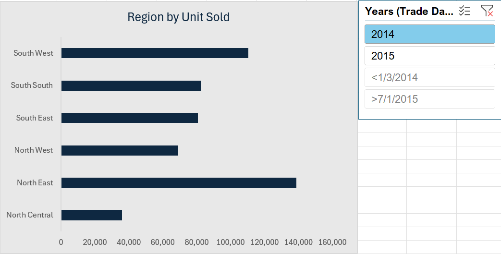
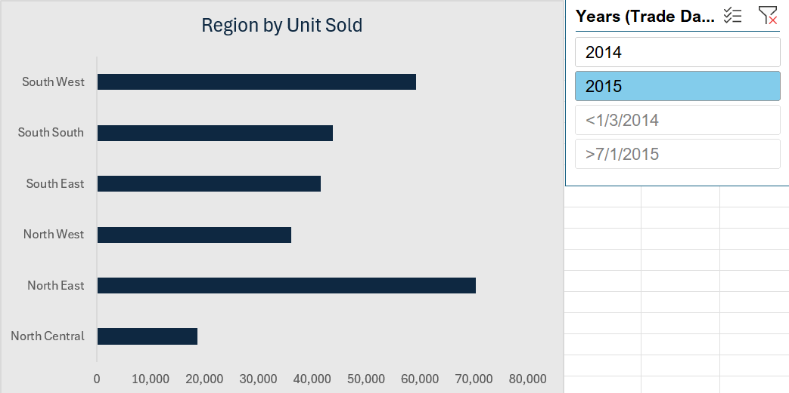
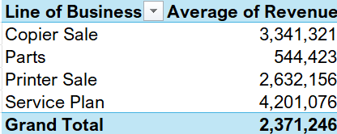
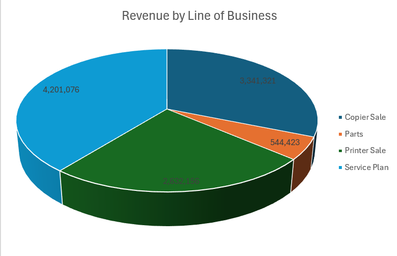
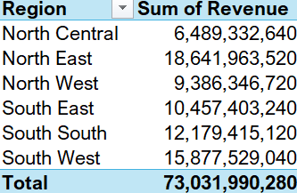
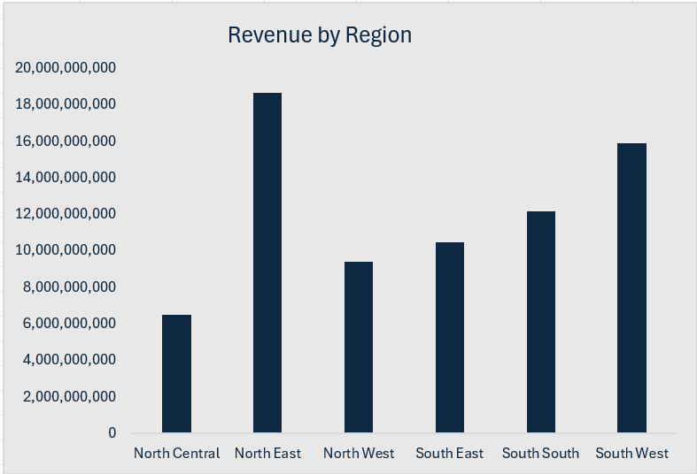

# Sales Revenue Project
---

## Introduction

This is an Excel project on sales analysis. The project is to analyze and derive insights to answer crucial and important questions and help make data driven decisions.

----

## Problem Statement

- What is the Region by Unit Sold
- What is the Average Revenue by Line of Business
- What is the Sum of Revenue by Region
- What is the Revenue by Trade Date (Year 2014 and 2015)
---
## Skills / concepts demonstrated

The following Excel features were incorporated;

- Pivot Tables,
- Charts,
- Slicers

## Visualization
This report comprises 3 pages

1. Data sets
2. Pivot Tables
3. Visuals using Microsoft Excel
-----

### Tools Used
- Microsoft Excel [Download Here](https://www.microsoft.com)
  
   1. For Data Cleaning
   2. For Analysis

 3. For Visualization

- GitHub for Portfolio Building
----

## Analysis:

**1. Region by Unit Sold:** 

This North East region is currently the region with the most units sold in the year 2015 and 2014 with 70,401 and 138,582 units sold respectively

Region by Unit Sold 2014                              |                           Region by Unit Sold 2015
:----------------------------------------------------:|:---------------------------------------------------------------:
                                   |             
                                  |            

---

**2. Average Revenue by Line of Business:**

There are 4 lines of businesses, but service plan have the highest revenue.

-----

**3. Sum of Revenue by Region:**

North east keeps having the highest sales.

-----

## Conclusion

- North East has the highest impact on sales or income. The region may be well positioned to capitalize in data analytics, such as big data applications, ensuring continued growth and leadership.
- There are 4 lines of business worth 73billion naira, and service plan is the most used service with the highest revenue.
-------

## Recommendation

- **Enhance Education and Training**: Invest in partnerships with local universities and colleges to create specialized programs that meet industry needs. This can include scholarships, internships, and workshops in data analytics.

 - **Invest in Infrastructure**: Ensure that high-speed internet and modern data storage facilities are available to support data-intensive operations.

 - **Focus on Branding and Marketing**: Promote success stories in data analytics from local companies to build a reputation as a burgeoning analytics hub. This can help attract talent and investors.

 - By examining the strengths of regions that lead in data analytics and by implementing strategic initiatives, other regions can cultivate their potential, attract talent, and enhance their revenue-generating capabilities in the data analytics sector.

-------

                                                

